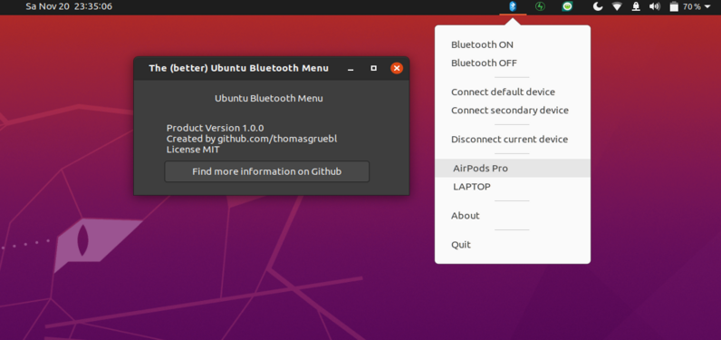

# ubuntu-bluetooth-menu

  <a style="text-decoration: none" href="https://github.com/thomasgruebl/ubuntu-bluetooth-menu/stargazers">

</a>
<a style="text-decoration: none" href="https://github.com/thomasgruebl/ubuntu-bluetooth-menu/fork">

</a>
<a style="text-decoration: none" href="https://github.com/thomasgruebl/ubuntu-bluetooth-menu/issues">

</a>

<p align=center>
  
</p>


## Features
- xxxxxxxxx


## Dependencies
- xxxxxxxxxxxx


## Installation

```console
# clone the repo
$ git clone https://github.com/thomasgruebl/ubuntu-bluetooth-menu.git

# navigate into the repo
$ cd ubuntu-bluetooth-menu 

# install requirements
$ pip3 install -r requirements.txt
```

```console
# run
$ python3 main.py [options]
```

## Usage

```console
$ ubuntu-bluetooth-menu --help
usage: ubuntu-bluetooth-menu [options]

optional arguments:
  -h, --help                            Show help information
  -c, --config                          Enter configuration mode
  -d, --default                         [In combincation with --config] Specify device ID of default device (e.g. --default E4:AF:22:11:22:33)
  -s, --secondary                       [In combincation with --config] Specify device ID of secondary device
  -na, --disable-autostart              By default, autostart is enabled. Disable autostart using this flag
```
